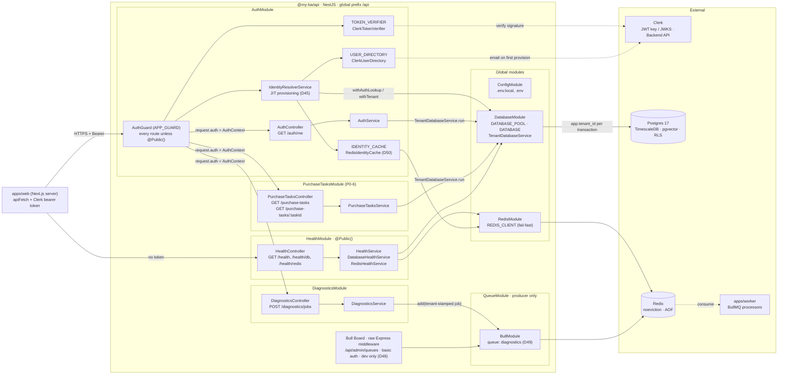

# 02 — Architecture

## Shape

A **modular monolith** with clean domain boundaries (tasks, suburbs, agents, listings, outreach, identity), deployed as one API app plus a worker app, from a Turborepo monorepo. Boundaries are drawn so that future service extraction is a deployment change, not a rewrite.

```
┌─────────────────────────────────────────────────────────────────────┐
│ PRESENTATION (Next.js App Router)                                   │
│ Task List │ Task Detail │ Report View │ Agent Portal │ Admin        │
└──────────────────────────┬──────────────────────────────────────────┘
                           │
┌──────────────────────────▼──────────────────────────────────────────┐
│ NestJS API + BFF                                                    │
│ REST + WebSocket (post-MVP chat) │ JWT auth │ tenant routing         │
│ Task CRUD │ Approval endpoints │ Agent routes │ Admin routes         │
└──────────────────────────┬──────────────────────────────────────────┘
                           │
┌──────────────────────────▼──────────────────────────────────────────┐
│ PURCHASE TASK ORCHESTRATOR (LangGraph.js)                           │
│ State machine: DRAFT → SCREENING → TREND → GROWTH → … → CONTACT     │
│ Checkpointer: PostgresSaver (durable interrupts)                    │
│ Policy engine: reads autonomy config, decides pause vs continue     │
│ Agents: SuburbScreener │ TrendAnalyser │ GrowthAnalyser │           │
│         PropertyScout │ AgentDiscovery │ OutreachCoordinator        │
│ Shared: MCP + REST tool registry │ memory (Redis + pgvector) │      │
│         eval harness │ HITL gate                                     │
└──────────────────────────┬──────────────────────────────────────────┘
                           │
┌──────────────────────────▼──────────────────────────────────────────┐
│ BULLMQ WORKERS (NestJS)                                             │
│ SuburbRefreshWorker (weekly) │ ScreeningWorker (per task)            │
│ EmailDispatchWorker          │ CensusIngestWorker (one-off + annual) │
│ AgentScrapeWorker                                                    │
└──────────────────────────┬──────────────────────────────────────────┘
                           │
┌──────────────────────────▼──────────────────────────────────────────┐
│ DATA INGESTION / EXTERNAL CLIENTS                                   │
│ HTAG REST (undici/fetch + Zod) │ HTAG MCP (@modelcontextprotocol/sdk)│
│ Domain API │ Apify JS SDK (RateMyAgent) │ ABS CSV snapshot          │
│ → Normalisation layer: canonical suburb entity, external ID mapping  │
└──────────────────────────┬──────────────────────────────────────────┘
                           │
┌──────────────────────────▼──────────────────────────────────────────┐
│ PostgreSQL + TimescaleDB + pgvector │ Redis (BullMQ) │ Cloudflare R2 │
└─────────────────────────────────────────────────────────────────────┘
```

## API module structure (`apps/api`)

A UML-style component view of the NestJS app as of P0-6: each box is a Nest module or provider, and arrows show the dependencies. Solid arrows are calls on the request path. Dotted arrows are out-of-band.



How to read it:

- **One way in.** `AuthGuard` is registered as `APP_GUARD`, so every controller is protected unless marked `@Public()` (only `HealthController` is). The guard is the only thing that builds an `AuthContext`, and controllers read it through `@CurrentUser()`.
- **One way to the data.** Request-path services touch Postgres only through `TenantDatabaseService.run`, which sets `app.tenant_id` for the transaction so RLS applies. `IdentityResolverService` is the one exception: it runs before a tenant is known and uses `withAuthLookup` (D46).
- **Globals.** `ConfigModule`, `DatabaseModule` and `RedisModule` are global, so feature modules inject `DATABASE`, `TenantDatabaseService` or `REDIS_CLIENT` without importing them. `QueueModule` is not global. Only modules that enqueue import it.
- **Fail fast on Redis.** Both `REDIS_CLIENT` and the BullMQ connection disable the offline queue. A Redis outage makes the identity cache a miss (falling back to Postgres) and makes enqueueing a 5xx, instead of hanging requests.
- **Outside the router.** Bull Board is mounted as Express middleware in `main.ts`, so the global guard doesn't cover it. It carries its own basic auth and never mounts in production.
- **Contracts.** Request and response shapes come from `@my-ba/shared` (Zod). Schema, pool and tenant helpers come from `@my-ba/db`. The API parses its own responses before returning them.

## Stack

| Component     | Choice                              | Notes                                                                                                     |
| ------------- | ----------------------------------- | --------------------------------------------------------------------------------------------------------- |
| Repo          | Turborepo + pnpm workspaces         | `apps/api`, `apps/web`, `apps/worker`, `packages/shared`                                                  |
| Backend       | NestJS (TypeScript)                 | Opinionated modules + DI map cleanly to domain boundaries                                                 |
| Frontend      | Next.js (App Router)                |                                                                                                           |
| Orchestration | LangGraph.js + PostgresSaver        | Chosen for built-in `interrupt()` / checkpoint / resume — exactly the HITL primitive needed               |
| Queue         | Redis + BullMQ (`@nestjs/bullmq`)   | Job Schedulers handle the weekly suburb refresh; Bull Board for monitoring                                |
| DB            | PostgreSQL + TimescaleDB + pgvector | One instance. Hypertable for suburb metrics time-series; pgvector for agent memory                        |
| ORM           | Drizzle (D33, LOCKED)               | Wins on hypertables + pgvector; no parallel migration systems to keep in sync                             |
| Auth          | Clerk (D41, LOCKED)                 | Clerk owns credentials, sessions, MFA. `users` mirrors it via `external_auth_id`. Flow: `08-auth-flow.md` |
| Object store  | Cloudflare R2                       | Scrape dumps, exports, later PDFs                                                                         |
| Email         | Resend or SendGrid                  | Platform-sent outreach, Spam Act compliance in the send path                                              |
| Hosting       | Railway or Render, Sydney region    | Single region for MVP                                                                                     |

## Key design decisions and why

**LangGraph.js, not hand-rolled.** The HITL pause/resume/checkpoint mechanism is the single hardest thing to build correctly, and it's LangGraph's core primitive. The JS port lags Python, so **P0-5 is a validation spike** — if durable interrupt + resume doesn't work cleanly, we fall back to a hand-rolled state machine with Redis-backed pause state, and the orchestrator design changes. Keep the orchestrator behind a narrow interface (`runStage(taskId, stage) -> StageResult`) so it's swappable.

**Screening queries our DB, not HTAG live.** A weekly `SuburbRefreshWorker` pulls all 7,000+ suburbs into `SuburbMetricsTS`. Task creation screens against the local cache. Only the Trend and Growth analysers hit HTAG live, for the ~10–20 shortlisted suburbs. Without this, every task creation burns 7,000+ API calls.

**Policy engine sits between orchestrator and agents.** Before any stage executes, it resolves `user config → agent type → autonomy level`, hierarchical: global default → per-agent-type override → per-run override. When HITL, the node calls `interrupt()` with a typed payload, the graph checkpoints, and the approval endpoint resumes with a command.

**Multi-tenancy from day one.** `tenant_id` on every table plus Postgres row-level security. Adding it retroactively is the expensive version of this decision.

**Normalisation layer is not optional.** HTAG uses H3 geo-indexing, Domain has its own IDs, RateMyAgent has neither. One canonical `Suburbs` entity maps all external IDs, with postcode + state as fallback matching.

## Scaling path

| Stage             | Architecture                                                                      | Trigger to move                                |
| ----------------- | --------------------------------------------------------------------------------- | ---------------------------------------------- |
| MVP (single user) | Modular monolith, one VM, managed Postgres + Redis                                | —                                              |
| Early users       | Same monolith, horizontal scaling, read replicas                                  | >100 concurrent users                          |
| Growth            | Extract AI orchestration into its own service (bursty, different scaling profile) | >100 agent runs/day                            |
| Scale             | Extract ingestion into event-driven pipelines; extract agent marketplace          | Refresh frequency and agent registrations grow |

## Known architectural risks

| Risk                                  | Impact                                    | Mitigation                                                                |
| ------------------------------------- | ----------------------------------------- | ------------------------------------------------------------------------- |
| LangGraph.js HITL rough edges         | Blocks every stage transition             | P0-5 spike gates Phase 1                                                  |
| HTAG rate limits on 7,000-suburb seed | Seed fails or throttles                   | Batch 500 with exponential backoff; weekly refresh only                   |
| Criteria→query mapping sprawl         | Screener logic becomes unmaintainable     | Cap criteria schema at 6–8 fields for MVP                                 |
| Checkpointer connection exhaustion    | Concurrent tasks starve the app           | Dedicated connection pool for the checkpointer                            |
| Agent data licensing                  | Scraped RateMyAgent data has ToS exposure | Apify actor, attribution, no redistribution; revisit before public launch |
