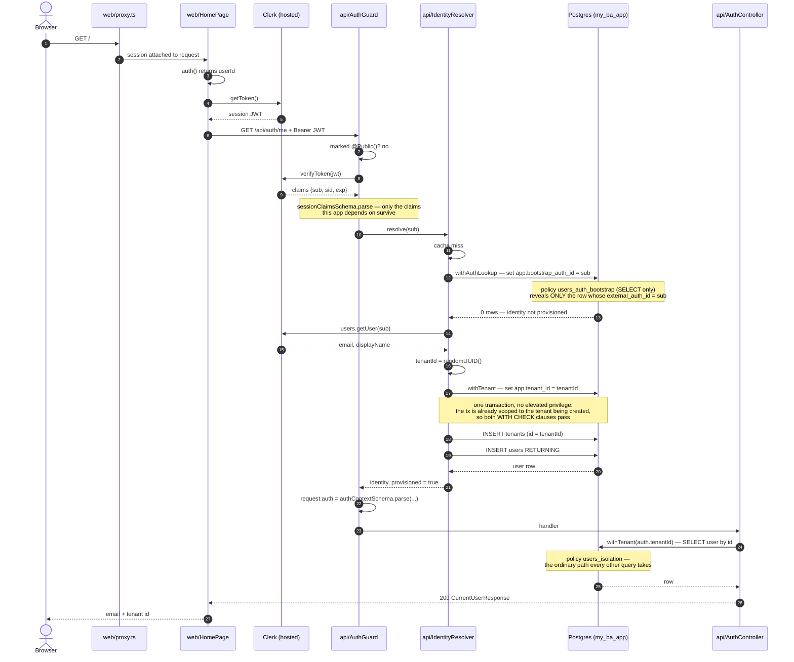
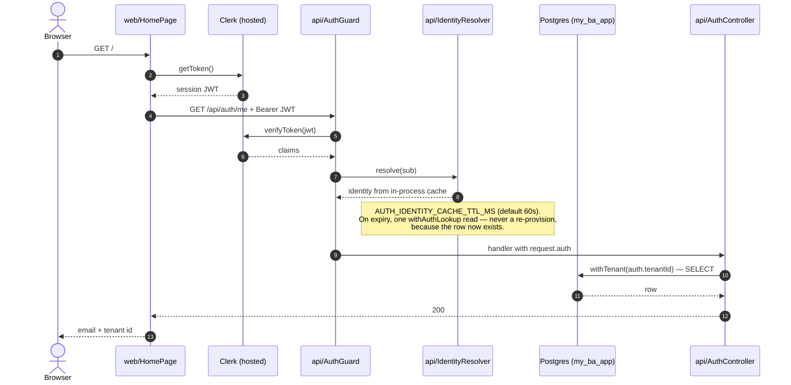

# 08 — Authentication Flow

How a Clerk identity becomes a tenant-scoped database transaction. Delivered in
P0-3; the decisions behind it are D41 (Clerk owns credentials), D45 (tenant-per-user,
resolved by lookup), D46 (the bootstrap GUC), D47 (just-in-time provisioning).

The one sentence version: **the token says who is asking, the database decides
which tenant that is, and nothing the client sent is consulted in between.**

---

## First authenticated request — identity is unknown

The final read is not decoration. `/auth/me` re-reads the row through
`TenantDatabaseService` rather than echoing the auth context, so a response body
proves the tenant-scoped path works. Echoing the token would have passed whether
or not RLS was functioning.

---

## Returning request — identity is cached

---

## The two settings, and why there are two

Both are transaction-local (`set_config(..., true)`), never session-level — a
pooled connection outlives the request, so a session GUC would leak one tenant's
scope into the next query on that socket.

| Setting | Set by | Policy it drives | Visible rows | Allows writes |
|---|---|---|---|---|
| `app.tenant_id` | `withTenant()` | `users_isolation`, `tenants_isolation`, `purchase_tasks_isolation`, `suburbs_*` | everything owned by that tenant | yes |
| `app.bootstrap_auth_id` | `withAuthLookup()` | `users_auth_bootstrap` | exactly one `users` row, matched by `external_auth_id` | **no** — the policy is `FOR SELECT` |

`withAuthLookup` exists for one query in the whole system: turning a verified
Clerk id into a tenant, before a tenant exists to scope by. Everything after
resolution goes through `withTenant`. The two are never in force together — if
the lookup also set a tenant, it would stop being limited to the bootstrap row
and start seeing a whole tenant's user list, which is asserted against in
`identity-resolver.service.spec.ts`.

With neither set, the app role sees an empty database. That is the design: a
query that loses its scope returns nothing rather than everything.

---

## Where each piece lives

| Concern | File |
|---|---|
| Session available to server components | `apps/web/src/proxy.ts` |
| Token attached to API calls | `apps/web/src/lib/api-client.ts` |
| Route protection (global, opt-out) | `apps/api/src/auth/auth.guard.ts` + `public.decorator.ts` |
| Token verification, swappable | `apps/api/src/auth/token-verifier.ts` |
| Profile read at provisioning, swappable | `apps/api/src/auth/user-directory.ts` |
| Resolution, JIT provisioning, cache | `apps/api/src/auth/identity-resolver.service.ts` |
| The only sanctioned way to query | `apps/api/src/database/tenant-database.service.ts` |
| GUC wrappers | `packages/db/src/tenant.ts` |
| Policies | `packages/db/sql/rls.sql`, `packages/db/sql/auth-bootstrap.sql` |

`TokenVerifier` and `UserDirectory` are interfaces behind DI tokens so the guard
never imports `@clerk/backend` directly. That is what makes D41's claim — the
provider can be swapped without touching a foreign key — true in code and not
just in the schema.

---

## Failure modes worth knowing

- **Concurrent first requests.** Both resolve to nothing and both provision.
  `users_external_auth_id_key` is global, so exactly one insert survives; the
  loser catches `23505` and re-reads the winner's rows. Both inserts share one
  transaction, so the losing tenant row rolls back rather than orphaning.
- **401s are deliberately vague.** The guard logs why verification failed and
  returns `Invalid or expired session token`. Telling a caller whether a token
  was malformed, expired or minted for another party is free reconnaissance.
- **A role change takes up to the cache TTL to apply.** Accepted at one user.
  When P0-4 lands Redis the cache moves there and invalidation becomes
  cross-process.
- **No `AUTH_DISABLED` flag exists.** The API refuses to boot without
  `CLERK_JWT_KEY` or `CLERK_SECRET_KEY`, because a switch that turns the guard
  off is a switch that can be set in the wrong environment.
